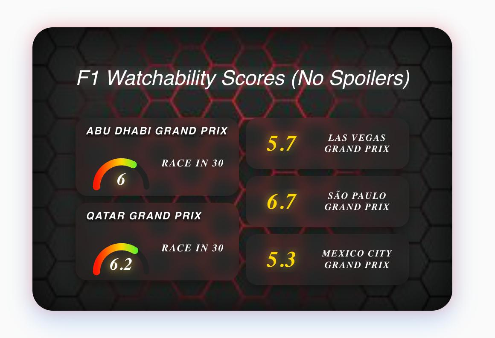
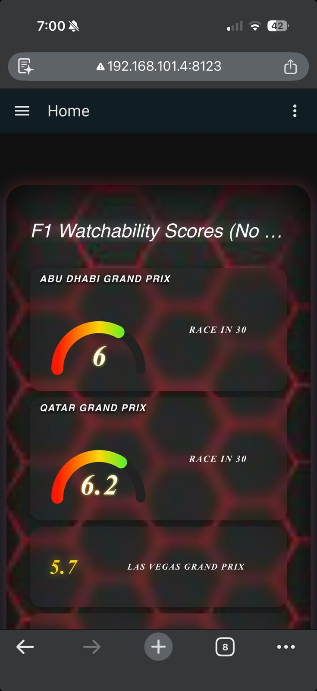
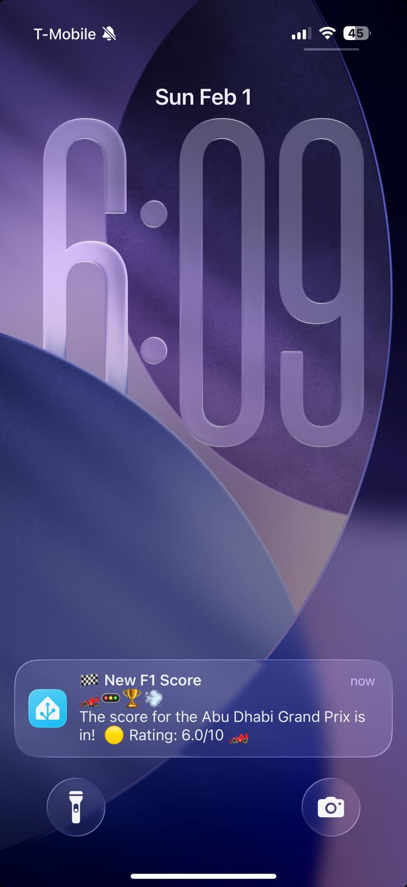

# F1 Watchability Engine

An open-source tool for Home Assistant to calculate and display a spoiler-free "Watchability Score" for Formula 1 races.

## Overview

This system helps you decide whether to watch a full race, a condensed version, or just the highlights, based on objective telemetry data correlated with historical fan sentiment. It fully supports calculating watchability for both **Grand Prix** and **Sprint** race sessions.

Starting in version 4.0, the watchability model incorporates **season-long driver championship standings stakes** alongside race telemetry. This allows the score to reflect the narrative importance of a session (e.g. close title fights, championship leader changes, title clinching races, and dead-rubber races).

The project is divided into three components:

1.  **Calibration** (`/calibration`):
    -   Scraping of race fan ratings for Grand Prix and Sprint sessions.
    -   Analyzes race telemetry via FastF1.
    -   Reconstructs historical season standings to generate championship metrics.
    -   Generates tailored, weighted models (`weights.json`) for both race formats.

2.  **Inference** (`/docker`):
    -   Standalone Docker container.
    -   Runs periodically (default 1h) and checks for race completions.
    -   Reconstructs standings on the fly and calculates the final watchability score.
    -   Publishes data to Home Assistant via MQTT.
    -   Updates `sensor.f1_watchability`.
    -   The Portainer branch contains a release that can be used directly through Portainer. See the branch readme for more information.

3.  **UI** (`/ui`):
    -   Lovelace Dashboard card.
    -   Displays the score, recommendation (🏎️/⏱️/📺), and history.

## Screenshots

  
  
  

## Getting Started

### Prerequisites

-   **Home Assistant** with MQTT broker (e.g., Mosquitto).
-   **Docker** (for running the inference worker).
-   Python 3.9+ (for local calibration).

### Installation

1.  **Generate Weights (Optional)**:
    -   If you want to recalibrate the model, go to `/calibration`.
    -   Update `calibration_config.json` if needed.
    -   Run `python calibrate_weights.py`.
    -   Copy `weights.json` to `/docker/weights.json`.

2.  **Setup Inference (Docker)**:
    -   Go to `/docker`.
    -   **Option A (Docker Compose)**: Copy `config.json`, edit it, set the `TZ` environment variable in `docker-compose.yml`, and run `docker-compose up -d --build`.
    -   **Option B (Portainer)**: Use `docker-compose.yml` as a Stack and configure Environment Variables (including `TZ`) directly in Portainer.

3.  **Setup Home Assistant**:
    -   Ensure your HA is connected to the same MQTT broker.
    -   Add the sensor configuration from `/ui/mqtt_config.yaml` to your `configuration.yaml` or `sensors.yaml`.
    -   Restart HA to load the new sensor.

4.  **Setup UI**:
    -   Open `/ui/button_card_templates.yaml` and copy the templates to your Dashboard's **Raw Configuration Editor**.
    -   Open `/ui/dashboard.yaml` and copy the card configuration to a "Manual" card on your dashboard.
    -   See `/ui/README.md` for detailed instructions.

## Automation & Notifications

Get notified as soon as a new race score is posted! You can use the provided [automation.yaml](automation.yaml) to set up a Home Assistant automation.

1.  Open [automation.yaml](automation.yaml).
2.  Copy the content into your Home Assistant `automations.yaml` or create a new Automation via the UI (using YAML mode).
### Notification Services

#### Option 1: Mobile App
Update the `action` section to point to your specific notification service (e.g., `notify.mobile_app_your_phone`).

#### Option 2: ntfy
The provided automation is pre-configured to work with [ntfy](https://ntfy.sh/).
1.  **Add ntfy Integration**: In Home Assistant, go to **Settings > Devices & Services > Add Integration** and search for **ntfy**.
2.  **Configure Service**: Enter your ntfy server URL (default: `https://ntfy.sh`).
3.  **Add Topic**: Create a new topic (e.g., `f1-watchability`) and give it a unique name.
4.  **Update Automation**: In `automation.yaml`, ensure the `entity_id` in the `notify.send_message` action matches your ntfy entity (e.g., `notify.f1_watchability`).

## License

Apache 2.0
